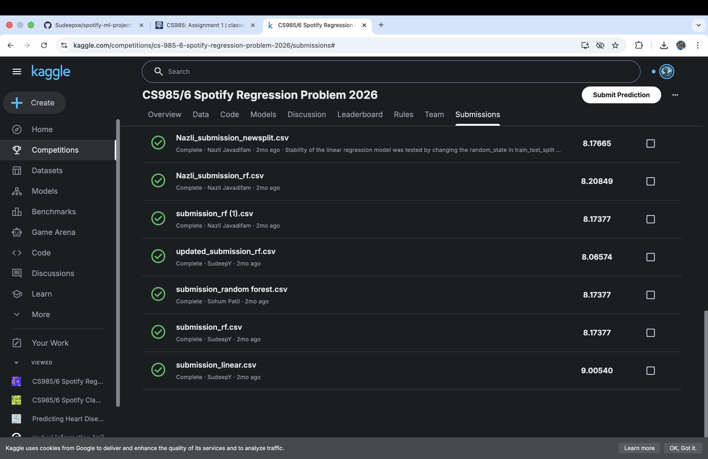
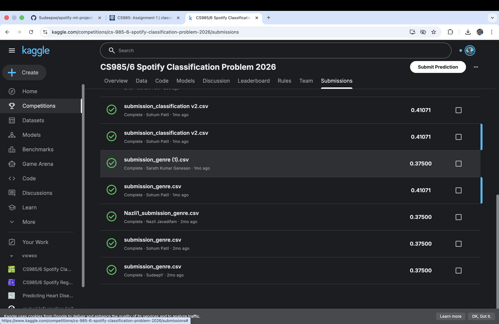

# 🎵 Spotify Machine Learning Project

This project was developed as part of my MSc coursework in Machine Learning for Data Analytics.

## 📌 Objective
The goal of this project is to:
- Predict song popularity using regression models
- Classify songs into genres using classification algorithms

## 📊 Dataset
- Source: Kaggle (Spotify dataset)
- Includes features such as danceability, energy, loudness, tempo, etc.

## ⚙️ Techniques Used
- Data Cleaning & Preprocessing
- Feature Selection
- Regression Models (Linear Regression, Random Forest, etc.)
- Classification Models (Logistic Regression, Decision Tree, etc.)
- Model Evaluation (RMSE, Accuracy)

## 📈 Results
- Achieved competitive performance on Kaggle In-Class Competition
- Compared multiple models and selected the best based on performance

## 🧠 Key Learnings
- Importance of feature engineering
- Model selection and evaluation
- Real-world dataset handling

## 🚀 Tools & Technologies
- Python
- Pandas, NumPy
- Scikit-learn
- Jupyter Notebook

## 📎 Note
This project was completed as part of university coursework and is shared for educational purposes only.

## 📈 Results
Model performance evaluated using Kaggle In-Class Competition.
### Regression Result

### Classification Result

## 👤 My Contribution

Although this was a group project, I independently handled:

- Full data preprocessing and cleaning
- Feature engineering
- Model building (Regression & Classification)
- Model evaluation and comparison
- Final Kaggle submission and performance optimization

Other team members contributed minimally in submission iterations.
